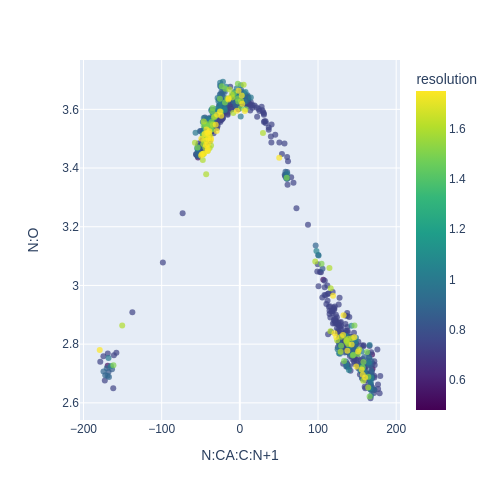
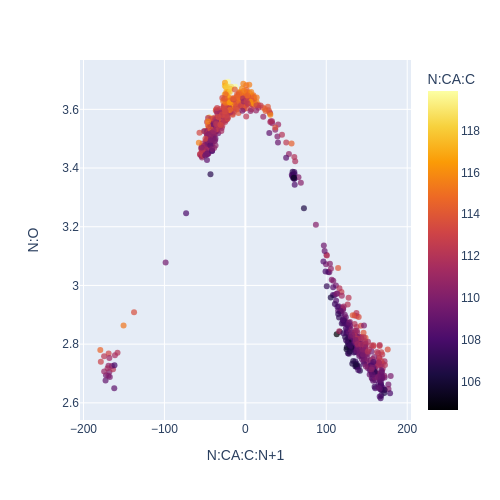
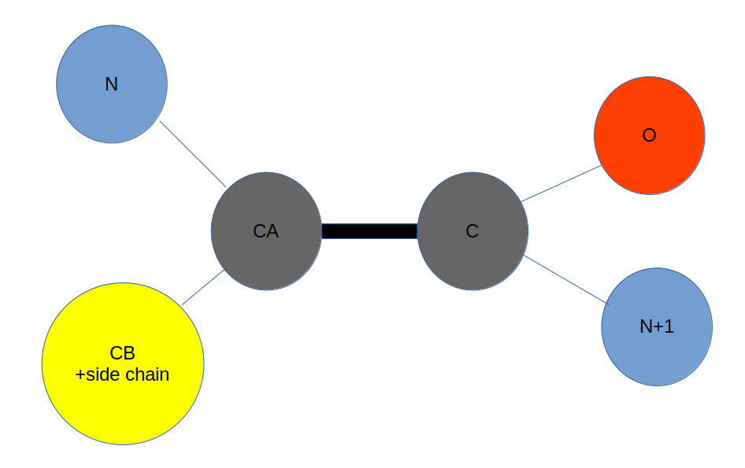
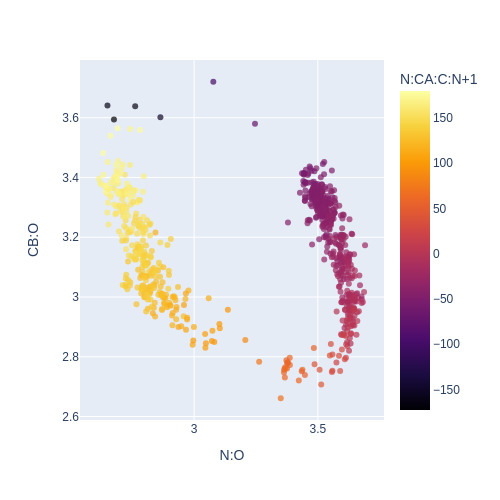
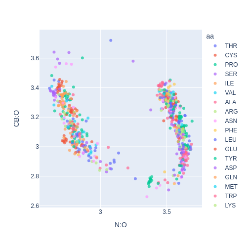

# Protein Geometry

Traditionally protein geometry is analysed based on Engh&Huber (2006) bond lengths, 
hydrogen bond lengths, and the Ramchandran plot.

Given the geometric nature of protein structures and the adherence to physiochemistry 
in bond lengths, there are correlations that can be predicted and measured that have a 
more regular appearance than the Ramachandran plot. These regular correlations may not
add new information, being formed effectively as an output of the decisions made in 
the input of the restraints used in the solution of the protein structures. 
However, when coupled with the question of experimental evidence the adherence
 or non-adherence to expected to expected geometric restraints is more interesting.

 An example is the correlation between psi (N:CA:C:N+1) and the atom distance N:O. 
 
 ### PSI and N:O - resolution
   
 This image shows a clear geometric sine-like correlation between the dihedral angle PSI 
 (N:CA:C:N+1) and the 3-atom distance N:O.  This is not so surprising if you consider that 
 PSI is a twist around the CA:C bond so the N+1 and O move respectively to the N 
 through the rotation.

 ### PSI and N:O - with TAU as the hue
  
This is more interesting, as we can see here a clear relationship with TAU - the angle 
of the backbone between atoms N:CA:C which remains elusive to analysis across literature.  
This is a clear relationship, and explicable if you think about the pressure that the 
atoms come under during the rotation - however it is not a geomatric relationship but one 
that suggests the forces on the atoms.  

### An atom picture to help
  

### CB:O and N:O - with PSI as the hue
  
Similar to the relationship with N:O we have CB where there is a CB (exc GLY) which is 
also a 3 atom distance from O and rotates relative to O in the same way as N, giving a 
sinusoidal relationship also between CB:O and N:O. 
When looking at this wrt to that relationship with PSI as the hue a relationship is clear. 
We might start to ask questions, like the 6 observations with a CB:O distance near 3.6Å.  

### CB:O and N:O - with amino acid as the hue
My immediate guess would be proline, either as the amino acid or before or after, 
but a quick check didn;t show anything so I leave that unanswered for now.
  

---  
### Colab Page to replicate
All the plots can be run from the colab example found here: 
[colab-geometry-intro](https://github.com/rae-gh/colab-analyses/blob/main/Density_Intro.ipynb)

 
