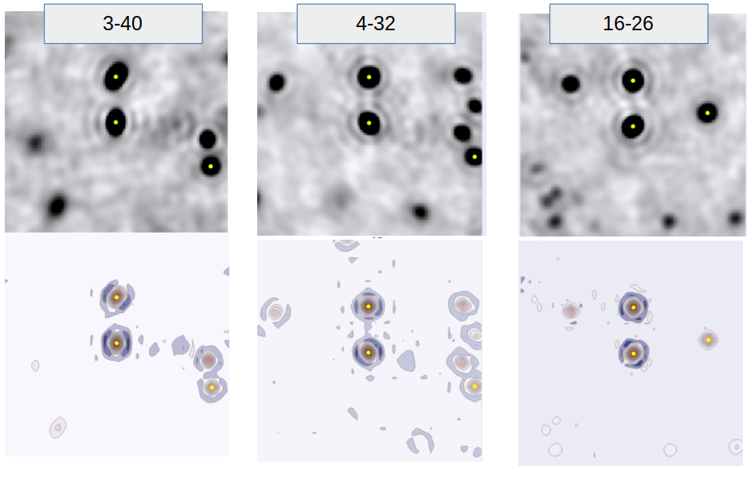
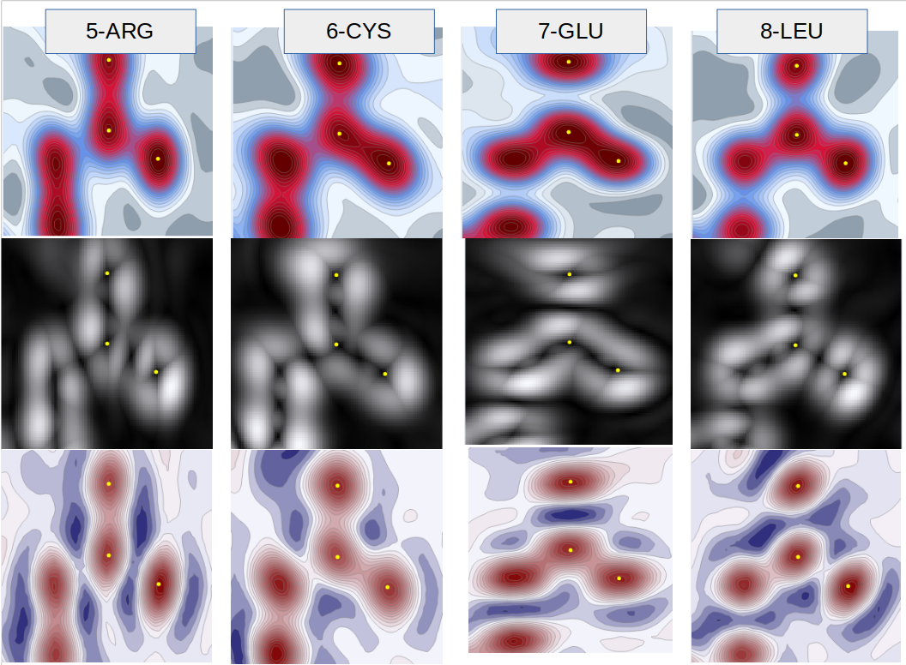
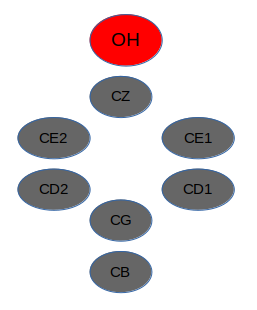

# The Laplacian - the 2nd derivative

The Laplacian is an important concept in charge density analysis. Pinoneered by Bader (1994), 
in his [Theory of Atoms in Molecules](https://www.chemistry.mcmaster.ca/aim/aim_5.html) the 
topological analysis of electron density through the Laplacian remains a popular analysis 
in ultrahigh resolution structure determination.  

The laplacian of electron density is the sum of the diagonal elements of the second 
derivative matrix, or the trace of the hessian.  

There is a nice document here about charge density analysis from Glasgow University, 
[Topological Analysis of Electron Density](https://www.chem.gla.ac.uk/~louis/xdworkshop/workshop/documentation/jyvaskla_4.pdf) (Faurrugia, 2007).  

My Laplacian is simply a 2nd partial derivative, and is not very illuminating because 
it so closely matches the density itself. I use a hue that has 0 as a middle and red and 
blue on the extremes (as I do with difference density) so that the features of the 2nd 
derivative as -ve or +ve are clear.  

## The laplacian of the disulfide bonds
If I look at the 2nd partial derivatives of the disulfide bonds in 1ejg, and compare them 
to the density, it would be hard not to be concerned about the rings.

And yet, can we dismiss it entirely? There are clear volumes of deeper density in specific 
locations around the atoms - is it the product of overlapping rings or real information?  

A challenge would be to remove the rings - what has held me back so far is the fear of adding 
layer upon layer of artifical interpretation and having no idea what is really left at the end.  

## The laplacian of an electron crystallograhy structure
If we add the laplacian to the density and radient of the 7uly peptide bonds we have calculated 
I am a little intrigued:

  

Now we have no rings and no model bias, and distinctive differences in the character of electron 
distribution in the peptide plane.  

Discussions about Gaussian interference are coming up ahead, however.  

## Critical point definitions
The laplacian is the diagonal of the Hessian, which is the sum of the 2nd partial derivatives. 
For all critical points, the signature of the critical point is the number of -ve or +ve 2nd 
derivatives. If it is a stable critical point it will have a **rank** of 3, that is 3 real eigenvalues.  
The signs of the eigenvalues define it's signature, where:  
- (3,-3) All negative eigenvalues - a local maxima  
- (3,-1) 2 negative, 1 positive - *a bond cp*  
- (3,+1) 1 negative, 2 positive - *a ring cp*  
- (3,+3) All positive, a local minimum - *a cage cp*  

We can use a simplified numerical scheme to itemise these as our values. 
I have called this "derivative" the criticalpoint - it involves both the radient and the 
laplacian for calculation so is more time-consuming. Where the (g)radient is not close to 0 
the colour is 0, so there is a 5 colour scheme:  
- -3 -> (3,-3) = dark red  
- -1 -> (3,-1) = pink  
-  0 -> NA     = black  
- +1 -> (3,+1) = pale blue    
- +3 -> (3,+3) = dark blue   

The image is greyed out where there is not a critical point. However this can lead to a very 
sparse image, so the arbitrary decision is made to categorise <0.75 as a critical point 
for the purpose of visualsation. As most of an atom is not at a critical point, this leads 
largely to the atoms themselves being greyed out - with the background a bit more noisy. 
Within the atoms you can see clearly the crtitical points and their signatures. 
Quite satisfactory for this structure:  
- all the atom positions are at maxima  
- 2 of the C=O bonds have a bond critical point  
- 2 of the C=O bonds have a ring critical point  

## A tyrosine ring
Because it is always nice to have the large plane of a tyrosine ring, I have the 4 derivatives 
for residue 44 in the crambin structure 3nir. 3nir is even higher resoluton than 1ejg at 
0.48Å (Schmidt et al, 2011).  I left the atom positions on the density image but removed them from 
the others so they don't obscure anything.  

I increased the samples to 120 to get a clear image as the width is 9Å. 

Orientation of above is:  

---  

## Colab Page to replicate
All the plots can be run from the colab example found here: 
[colab-maps-laplacian](https://github.com/rae-gh/colab-analyses/blob/main/Maps/Laplacian.ipynb)

