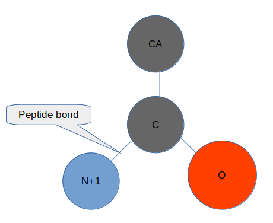
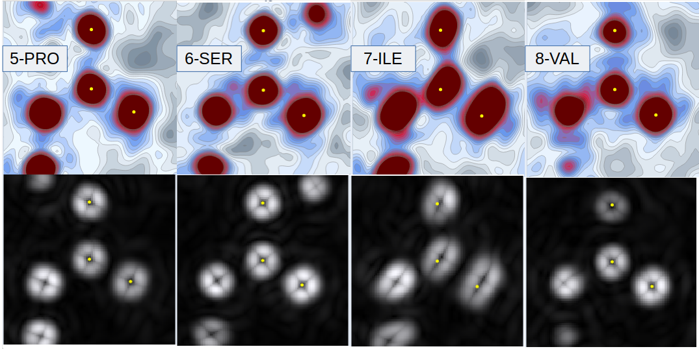
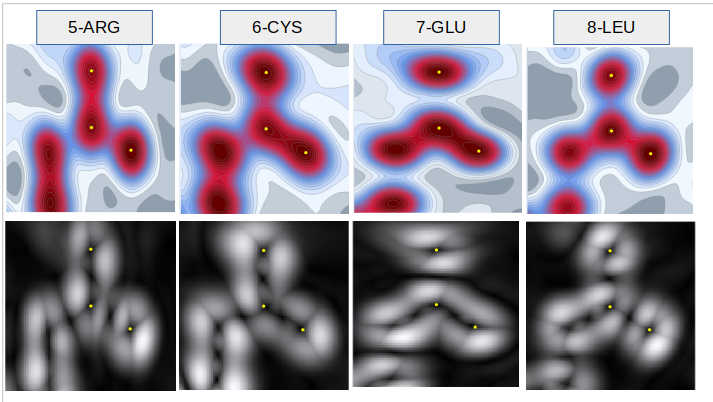

# Radient - a 1st Derivative

## The term 'radient'
I coined the term 'radient' to describe a form of volumetric 1st derivative. The name derives 
from 'gradient' without the 'g' - and is named because it describes the particular feature of 1st 
derivatives of volumetric spheres where radial lines eminate from the maxima positions.  

The use of arbitrary grid lines is not popular in physical interpretation - yet it 
provides an incredibly handy visual guide for the literal direction to the maxima and is 
therefore of great practical use in this circumstance.  

Additionally, the saddle points of the bonds between atoms are also displayed with radial 
lines. These guiding lines to the interpretation of the features of the electron density 
maps complement the existing analysis where the Laplacian 2nd derivative is favoured 
for the identification of important features in electron density (Bader, 1994).

The radient is the l1 norm of del, derived from the 1st partial derivatives. 
Or, it is the absolute value of the sum of the 1st partial derivatives. 
I could lose the radient lines and be more standard by using the square of the sum of the 
1st partial derivatives, but I have found the radient lines to be valuable in interpretation. 
Particularly when navigating through density space to search for features.  

## An atom picture to help
This shows the orientation of the images below.  

## Interpreting the radient lines
In the image below I have used the same peptide bonds as per the overview images of crambin, 
1ejg - an ultra high resolution structure at 0.54Å (Jelsch et al, 2000).

Some clear features are shown that are particular to the radient images:  
- In residue 7 the atom positions deposited are evidently not at the maxima for C and O.  
- In residue 8 the peptide plane is evidently not planar as N+1 is not on the plane (the maxima is not visible).  

## Visual decisions for interpretation
I have used an esoteric pallette of my choice for the density visualisation and stuck to a 
standard black and white for the density. I have also used contour maps for the 
density but heatmaps for the radient.  

These choices are made following substantial investigation, and include settings to dial 
the limits at the upper and lower end to increase the appearance of density in the correct range. 
The density also has a setting of 0, with grey below 0 and the blue->red clour scale above. 
There should not be negative density.  

The radiant is a straight scale, where 0 as a first derivative has no specific meaning 
(it does for the Laplacian) and the contours distract from the radient lines if included.  

In order to achieve the level of sharpness I needed for the heatmaps I had to increase 
samples in the density images to 100, whereas with the less sensitive density contour 
plots I could use 50 - this has significant time savings.  

For both these images I am using a bspline interpolation method, for rapid 
navigation to seek information I would choose density:contours:linear:50, and only for the 
verification of thought or the production of images might I increase to the more numerically 
intense bspline at higher sampling.  

## The elctron crystallography structure 7uly
Having produced 4 peptide bond density images fopr the high res eletron crystallogrpahy 
strucure 7uly (0.87Å) I have the radient images too:  

  

These images are suggestive of a lower resolution than 1ejg (0.54Å vs 0.87Å but it seems like more). 
The electron density in the peptide plane across C:O:N+1 of the 7th residue glutamate 
suggests something interesting in terms of electorn distribution - distinct from the others.  

---  

## Colab Page to replicate
All the plots can be run from the colab example found here: 
[colab-maps-radient](https://github.com/rae-gh/colab-analyses/blob/main/Maps/Radient.ipynb)

